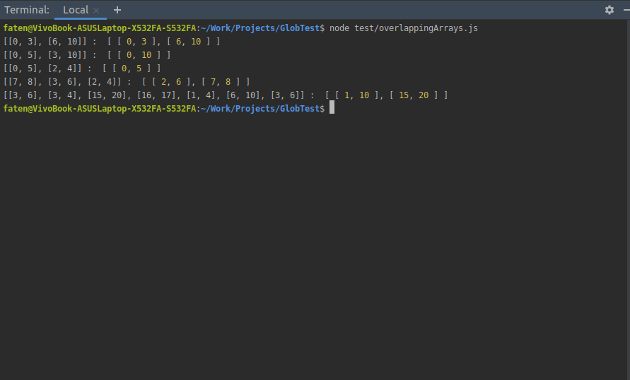

# Overlapping Arrays


## Question 1

Foo is a function that takes arrays as argument who arrays contain number pairs. Think of these number pairs as "start" and "end". And loop trough its content, and check for the pairs if they overlap, these pairs are merged into one.

## Question 2

FOO function is in overlappingArrays.js file.
In terminal, Run the script by 

```
node test/overlappingArrays.js
```
Result: 




## Question 3

Implementation time

```
2h30
```
